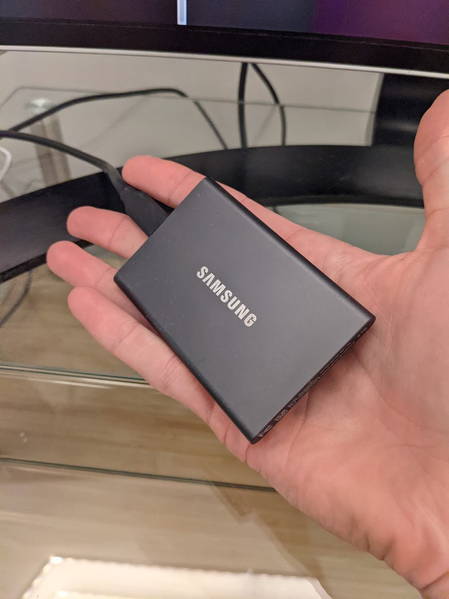

# Documenting Rides

## Ride-Tracking Apps

### Strava <a id="strava"></a>

I like [Strava](strava.com) for recording and sharing rides. I pay them an annual fee, the app is well built, and they don't try to own my data in any way. It also serves as an uncomplicated, shared-interest-driven social network.

### [wandrer.earth](https://wandrer.earth/) <a id="wandrer.earth"></a>

This is an app I love that lives on top of Strava's API, imports your Strava history, and gives you cool statistics and visualizations about where you've been.

The "[Big Map](https://wandrer.earth/dashboard/map#7.75/40.618/-73.792)" is one of the main attractions:


I have a shortcut to this page on my phone home screen. On some rides I leave it open and use it to navigate in real-time, trying to ride as many new/unexplored roads as possible. It's really fun and a cool way to explore an area.

wandrer.earth also showcases some good open-data norms in the apps people use for these purposes; it sits on top of Strava and provides some additional, more niche features that I also pay for \(separate from my underlying Strava subscription\). After all the perversity of consumers' relationships to big, ad-driven tech co's, there's something nice about having these clear, transactional relationships with developers making useful apps but not trying to own me or my data or my eyeballs!

### [RideWithGPS](https://ridewithgps.com/)

Very similar to Strava, a bit more emphasis on heavy-duty route planning/sharing, and less on social features.

I'm starting to use it more, as it appears to be the de facto way people create and share routes \(though Strava seems to have comparable features, or be copying them?\).

### [Relive](https://relive.cc)

Similar to Strava or RideWithGPS, with an emphasis on rendering cool 3D flyover videos of your routes, after the fact. I used it a couple of times and found it a bit less robust than Strava \(less smooth-/robust-feeling at starting/stopping/backing up rides\), and the videos felt a little one-note after seeing a dozen or so of them, so I don't use it regularly.

## Post-Processing Videos

Filming rides can generate huge amounts of data. For example, my laptop's 1TB SSD could hold ≈45hrs of "low-res" \(1080p24\) video \(if there was nothing else on it\).

In ≈2 years, I've shot about 10x that much, so I've had to bring a lot of hardware and software to bear on storing and processing that data.

### GoPros

[My GoPros](gear.md#action-cameras) can shoot 4K60, but for a while I ratcheted all the way down to 1080p24 \(their minimum\), to streamling editing/storing all that data. Now I typically shoot 4K30 on my Hero 9 and 2.7K30 on my Hero 8 \(which also causes them to need battery changes at about the same rate, since the latter's battery is smaller\).

#### Chapters

On disk, long GoPro shots are cut into ≤4GB "chapters" \(≈11mins at 1080p24, ≈9mins at 4K30\). This detail surprised me \(and [others](https://community.gopro.com/t5/Cameras/Split-Video-Files-Chaptering/td-p/761115) around [the internet](https://havecamerawilltravel.com/gopro/gopro-split-video-files/)\) because you essentially have to use [a VFX studio](documenting-rides.md#vfx-suites) to do anything with your GoPro data.

#### Telemetry Data <a id="telemetry"></a>

I've found it extremely difficult to do anything with the telemetry \(GPS, speed, etc.\) data that GoPro embeds in its videos.

There is basically no way to join "chapters" that preserves GoPro's this data.

* [Someone open-sourced a GPMF parser](https://github.com/stilldavid/gopro-utils) \(and JSON/GPX exporter\), and [someone else forked it and carried the torch forward a bit](https://github.com/marengaz/gopro-utils), but neither has been updated in years.
* [Here's my fork](https://github.com/runsascoded/gopro-utils/) that I will hopefully make broadly usable / up-to-date at some point.

They all require `ffmpeg` to extract the raw GPMF data first, e.g.:

```text
ffmpeg -y -i GOPR0001.MP4 -codec copy -map 0:m:handler_name:" GoPro MET" -f rawvideo GOPR0001.bin
```

[GoPro's "Quik" app can't even read the telemetry from their newest cameras](https://community.gopro.com/t5/GoPro-Apps-for-Desktop/hero-9-not-showing-telemetry-overlays-on-gopro-quik/td-p/782383). It's a surprisingly messy situation for the most famous action-camera brand.

One talented developer has built a custom VFX suite for GoPros, the [GoPro Telemetry Extractor](https://goprotelemetryextractor.com/free/), that you can buy for $300 \(or various subsets of the functionality for less\), but it's pretty awkward to have a whole 3rd-party VFX studio just to get basic telemetry out of the cameras.

Other rough edges:

* [GoPros won't record GPS data \(nor other telemetry, IME\) if you use "Quick Capture" to start filming](https://community.gopro.com/t5/GoPro-Telemetry-GPS-overlays/GoPro-GPS-not-working-Performance-stickers-and-telemetry-FAQ/gpm-p/419554) \(i.e. just push the button, as opposed to turning the camera on, waiting for a GPS lock, and then starting to film\).
* [GPS signal doesn't work if the camera is upside-down, or its GPS antenna \(on top somewhere\) is obstructed](https://community.gopro.com/t5/GoPro-Telemetry-GPS-overlays/GoPro-GPS-not-working-Performance-stickers-and-telemetry-FAQ/gpm-p/419554) \(same forum post\). In general, GPS is expected to be worse than a phone's \(which can also use cellular info to triangulate\).
* If you leave a GoPro sitting around without a battery for a while, a smaller internal battery that powers the clock will die, and the time will reset to 1/1/2016. It will not fix itself until you connect a device to it \([even though it could infer the time via GPS](https://community.gopro.com/t5/Cameras/Does-the-GPS-not-set-the-internal-clock-on-the-Hero-5/td-p/273877)\).

### External SSDs <a id="ssds"></a>

I started with [a 1TB external SSD](https://www.amazon.com/gp/product/B073H552FJ/) and added [a 2TB](https://www.amazon.com/gp/product/B0874XWW23/) later. These things are pretty incredible, they fit in your palm:



### Wasabi \(Cloud Storage\) <a id="wasabi"></a>

Eventually I filled up the 2TB too, and started putting data in [Wasabi](https://wasabi.com/) \(cheap cloud storage w/ good tooling\). I'm 2-3mos into using that, with ≈8TB stored, and planning to use it as my canonical/archival store, upload new videos there automatically, and have downstream pipelines that react to them landing there.

My SSDs are not backed up anywhere so they might become an [LRU cache](https://en.wikipedia.org/wiki/Cache_replacement_policies#Least_recently_used_) of data in Wasabi. Given the price points, I'd rather pay-as-I-go on Wasabi than capacity-plan and deploy a RAID array on my desk 😁.

### 512GB micro-SD <a id="micro-sd"></a>

My GoPros each record to [a 512GB micro-SD](https://www.amazon.com/SAMSUNG-Select-microSDXC-Adapter-MB-ME512HA-dp-B0887CHVFF/dp/B0887CHVFF/):

 _where does all that data go…? 🤯_


I started with smaller SD cards, but worrying about the camera card's capacity was too annoying \(on top of juggling battery + spares and archival storage capacity post-ride\), and ultimately solvable for $75.

### VFX Suites <a id="vfx"></a>

I resisted using proper VFX suites to process my GoPro videos for a while, but ultimately caved, bought [Final Cut Pro](https://www.apple.com/final-cut-pro/), and have been learning to use it. It does a good job abstracting over [the 4GB GoPro "chapter" files](documenting-rides.md#chapters) that every shot is broken into, and is easy to use for speeding up / cutting video.

It has a steep and long learning curve, but the official documentation forums and YouTube tutorial ecosystem are pretty robust. I want to script things on top of it and/or directly access the SQLite files it stores projects/metadata in, and that all sounds hard and annoying, but it's clearly a powerful tool I can continue learning to use for a while.

I eventually need to try+buy the [GoPro Telemetry Extractor](https://goprotelemetryextractor.com/free/) as well.

I used to use GoPro's "Quik" app just for an auto-import when I plug my SIM in, but I always found Quik unusable as a VFX suite. I pay $5/mo for GoPro's "unlimited cloud storage" as well, but the uploads were so slow that I don't even bother with it anymore either \([I back up to Wasabi now](documenting-rides.md#wasabi)\), and have given up on Quik altogether.

### YouTube <a id="youtube"></a>

When all of that stuff works well together, I sometimes post ride videos to [my "Neighbor Ryan" YouTube channel](https://www.youtube.com/channel/UCUEDi4kDGExvmx0g0gkVwkA/videos).

## 

